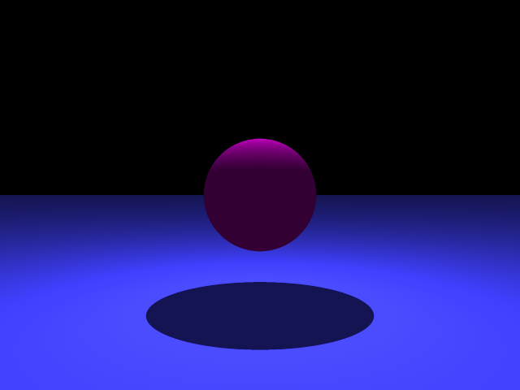

# RayTrace

## Soft Lighting

I chose to implement soft lighting using multi-sample area lights. I felt this
feature would do the most to help create interesting images without requiring an
extensive redesign of software components.

My research of soft area lights included the section on soft shadows in the
Shirley textbook and the [pov-ray specification for area lights](http://www.povray.org/documentation/view/3.6.0/313/).

Until now, lights have been represented as as single points. The result is that
shadows cast by the light have hard edges.



In reality, lights are not a single point in space, but emit light in an area
around their centers. For example, a lightbulb emits light from the entire
surface of the bulb.

I model this behavior by treating area lights as an array of point lights and
blending the light contribution of each of these samples when calculating shadows
and local colors.

Some examples images rendered with soft lighting are shown here.


---

## Software Design

I designed my ray tracer to have relatively small functions that belong to relevant
classes. Because functions are smaller (the longest function in the `Renderer` class is 60
lines), they are easier to read and understand. This compartmentalization also allows for
the testing of smaller pieces of code responsible for only one thing.

The functions responsible for Monte Carlo global illumination in the `Renderer` class are a
good example of this practice. If a boolean flag has been set, then the ambient term of an
object's color is determined by a call to  `monteCarloAmbient()`. In turn,
`monteCarloAmbient()` produces a number of reflected rays that are created in the
`monteCarloRay()` function. These rays are themselves seeded using cosine-weighted sample
points generated in `monteCarloSample()`.

```c++
Vector3f Renderer::monteCarloSample(const float u, const float v) {
    const float radial = sqrt(u);
    const float theta = 2.0 * M_PI * v;

    const float x = radial * cos(theta);
    const float y = radial * sin(theta);

    return Vector3f(x, y, sqrt(1 - u));
}

Ray Renderer::monteCarloRay(const Matrix4f &rotation, const Vector3f &n, const Vector3f &p) {
    const float u = rand() / (float) RAND_MAX;
    const float v = rand() / (float) RAND_MAX;

    Vector4f dir;
    dir << monteCarloSample(u, v), 0;
    dir = rotation * dir;

    return Ray(p + epsilon * dir.head(3), dir.head(3));
}


Vector3f Renderer::monteCarloAmbient(const Vector3f &p, const std::shared_ptr<Geometry> object, const int depth, const int samples) {
    Vector3f ambient = Vector3f(0, 0, 0);

    const Vector3f n = object->normalAtPoint(p);

    float angle = acos(Vector3f::UnitZ().dot(n));
    Vector3f axis = Vector3f::UnitZ().cross(n);

    Matrix4f rotation = Matrix4f::Identity();
    rotation.block<3, 3>(0, 0) = (AngleAxisf(angle, axis)).toRotationMatrix();

    for (int i = 0; i < samples; i++) {
        const Ray r = monteCarloRay(rotation, n, p);
        floatOptional t;
        auto hitObj = scene->firstHit(r, t);
        if (hitObj) {
            const Vector3f hitP = r.getPoint(t.value);
            const Vector3f color = calculateColor(r, hitP, hitObj, depth + 1);
            ambient += (1.0 / samples) * color;
        }
    }

    return ambient;
}
```
