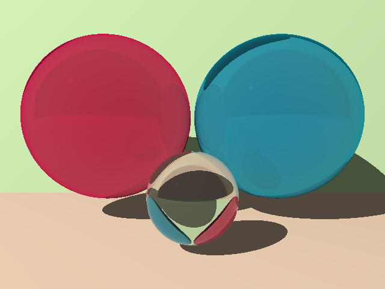
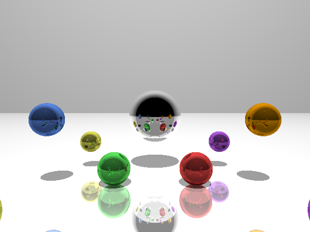
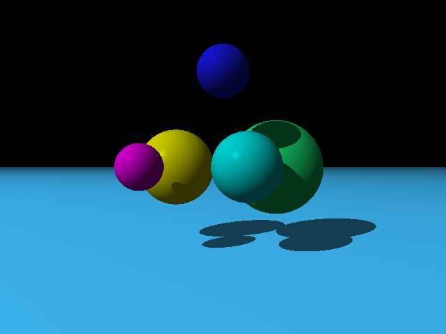
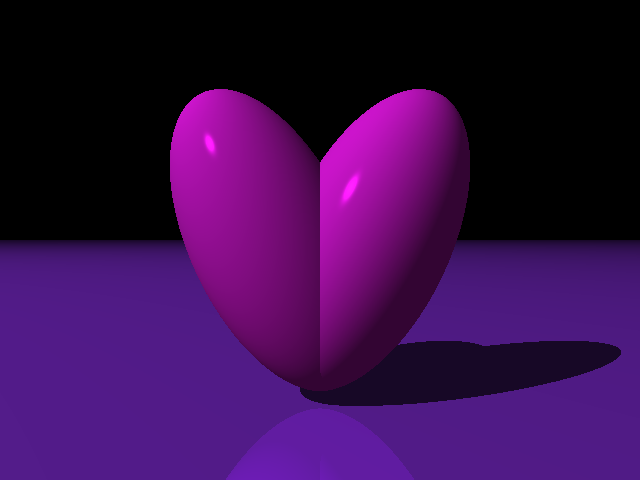
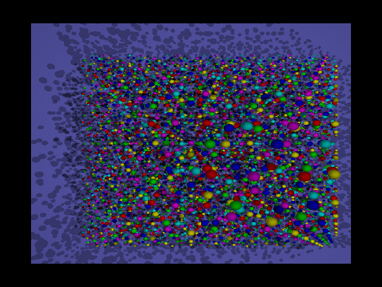
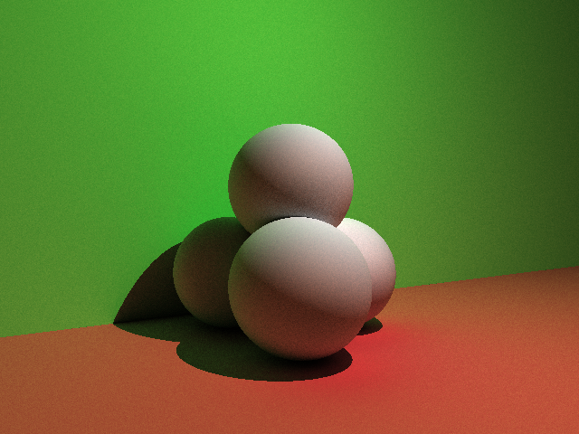
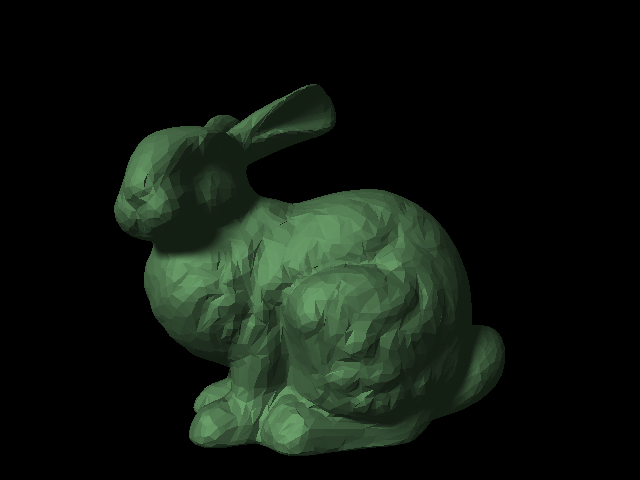
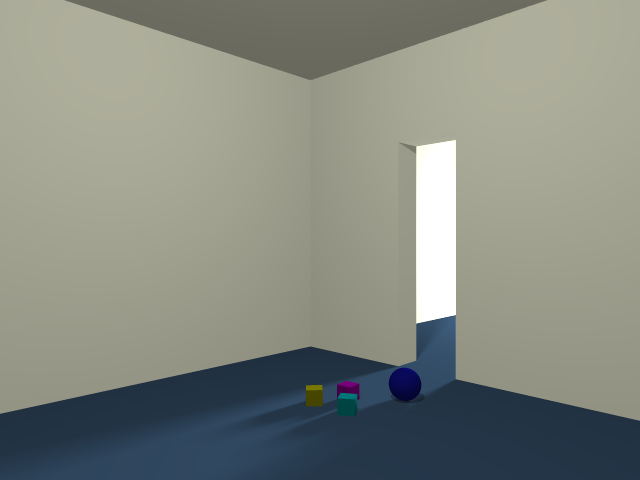

# RayTrace

This project is a physically based ray trace renderer implementing a subset of
the POV-ray scene description language. It provides supports for a number of
geometric primitives, including boxes, spheres, and planes, as well as more
complex triangle meshes.

---

# Features

The ray tracer supports the following features.

## Reflection and Refraction

* Physically-based refraction and reflection including approximations for
fresnel reflectance and energy conservation

## Antialiasing

* Antialiasing with variable number of subpixel samples

## Spatial Transformations

* Arbitrary spatial transformations of geometric objects

## Bounding Volume Hierarchies

* Bounding volume hierarchies for fast ray intersection calculations for large
scenes

## Monte Carlo Global illumination

* Monte Carlo global illumination with variable depth and samples

## Soft Area Lights

* Soft lighting and shadows through use of multisample area lights

